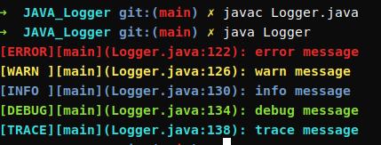

# small-toys

some simple things for playing

## happy_birthday

a simple music player and turtle drawing of happy birthday

## Convert_xlsx_into_SQL_insert

> a convert of using xlsx generator sql insert query, which is more easy for people who want to using a simple ways to input data into mysql database by sql*( which could help us to spread our low data's database in team without any kinds of remote mysql server )*

**The specification for input of the xlsx file are as follows:**

1. database's table name should be equal to xlsx file sheet name, which i using it as a kind of help to insert.
2. the first line of the sheet should be equal to MYSQL table attribute name [i not sure that necessary]

**Run**

> just using `python3 generator... `, then input or do nothing

## JAVA_Logger

> A implement of a simple console colored log output, which has a kind of similar to rust's log

